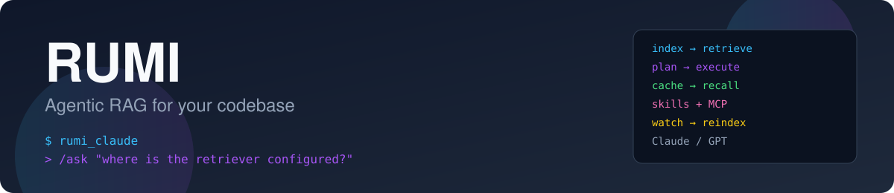
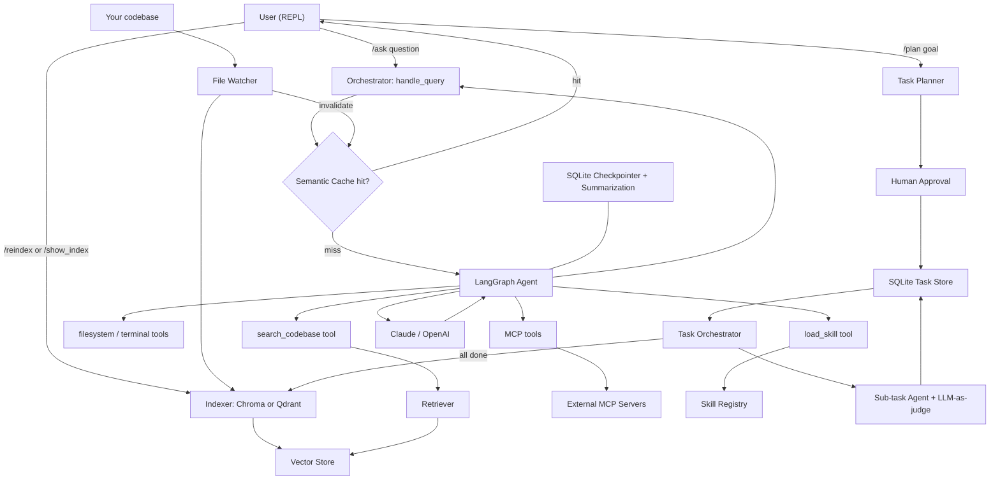

<div align="center">



# RUMI

**An agentic RAG system that lets you talk to, plan against, and build on your own codebase.**

</div>

RUMI is a terminal-based coding assistant that indexes a repository into a vector
store, answers questions about it through a tool-using LLM agent, and can turn a
high-level goal into an approved, dependency-ordered execution plan that it then
carries out task by task. It combines retrieval-augmented generation, LangGraph
agents, a semantic cache, a skills system, MCP tool integration, and a crash-safe
task orchestrator into a single REPL.

## Features

- 🔍 **Codebase RAG** — indexes your repo (Chroma or Qdrant, dense or hybrid retrieval) and answers questions with cited files/functions/line numbers.
- 🤖 **Tool-using agent** — a LangChain/LangGraph agent backed by Claude or OpenAI, with a `search_codebase` tool, filesystem/terminal tools, and merged MCP tools.
- 🧠 **Persistent memory** — SQLite-backed conversation checkpointing with automatic summarization, plus named sessions you can create and switch between.
- ⚡ **Semantic cache** — an optional Redis-backed embedding cache that skips repeated agent/tool calls for similar questions, invalidated automatically on file changes.
- 👀 **Live re-indexing** — a debounced file-system watcher keeps the vector index (and cache) fresh while you edit.
- 🗂️ **Autonomous planning** — turn a goal into a structured, human-approved DAG of tasks, executed by scoped sub-agents with LLM-as-judge grading and crash recovery.
- 🧩 **Skills** — drop-in `SKILL.md` packages that the agent can discover and load on demand (progressive disclosure).
- 🔌 **MCP integration** — connect external MCP servers and expose their tools to the agent via config.

## Architecture



**Flow summary**

1. **Indexing** — on startup (and on `/reindex` or file-watch events) the repo is parsed and embedded into the configured vector store.
2. **Ask** — `/ask` first checks the semantic cache; on a miss, the LangGraph agent runs, calling `search_codebase` (and filesystem, terminal, MCP, or skill tools as needed) before answering, then the answer is cached.
3. **Plan** — `/plan` asks an LLM planner for a structured, dependency-ordered task list, walks you through approval (approve / edit / reject & re-plan), then a serial `TaskOrchestrator` claims ready tasks, runs each in its own scoped sub-agent, and grades the result with an LLM-as-judge before marking it complete. The repo is re-indexed automatically once the plan finishes so `/ask` can see the new code.
4. **Memory & recovery** — conversations persist via a SQLite checkpointer with summarization; task runs persist in their own SQLite store so a crashed `/plan` can be resumed and recovered instead of restarted.

## Project layout

```
rumi_claude/
├── main.py                  # REPL entry point and command dispatch
├── config.py / config.yaml  # provider, vector store, cache, task settings
├── agent/                   # agent factory, orchestrator (handle_query), tools
├── context/
│   ├── indexers/            # semantic_chroma / semantic_qdrant / hybrid_qdrant + file watcher
│   └── retrievers/          # matching retrieval backends
├── llm/                     # LLM + embedding provider factory
├── cache/                   # Redis-backed semantic cache
├── memory/                  # session tracking + SQLite conversation checkpointer
├── tasks/                   # planner, approval UI, task store, orchestrator, executor, recovery
├── skills/                  # skill registry + skill loading tools
├── mcp/                     # MCP server config + client
├── tools/                   # filesystem and terminal tools
└── observability/           # logging
```

## Getting started

### Prerequisites

- Python 3.12+
- [Poetry](https://python-poetry.org/) (or `pip`)
- API keys for the LLM/embedding providers you configure (OpenAI and/or Anthropic)
- Optional: a running Redis instance if you want the semantic cache; Qdrant if you set `vector_store.provider: qdrant`

### Install

```bash
git clone https://github.com/leninathikam/RUMI---An-agentic-RAG-system-for-codebases.git
cd RUMI---An-agentic-RAG-system-for-codebases
pip install -e .
```

### Configure

Create a `.env` file in the project root:

```env
OPENAI_API_KEY=your_key
ANTHROPIC_API_KEY=your_key
```

Adjust `rumi_claude/config.yaml` to pick your LLM/embedding provider, vector store
(`chroma` or `qdrant`), RAG mode (`semantic` or `hybrid`), and whether the semantic
cache is enabled.

### Run

From inside the repository you want RUMI to index and reason about:

```bash
python -m rumi_claude.main
# or, if installed as a script:
rumi_claude
```

## Usage

Once RUMI is running you get a `>` prompt. Available commands:

| Command | Description |
|---|---|
| `/ask <question>` | Ask a question about the current codebase |
| `/show_index` | Show all chunks currently in the index |
| `/reindex` | Manually re-index the current directory |
| `/new_session` | Start a fresh conversation |
| `/switch <session_id>` | Resume a past session |
| `/session` | Show the current session id |
| `/plan <goal>` | Generate an execution plan and run it, task by task |
| `/task_status` | Show progress of the active plan/project |
| `/exit` / `/quit` | Quit RUMI |

**Example**

```
> /ask how does the semantic cache decide on a cache hit?
> /plan add a /health endpoint with a unit test
> /task_status
```

## License

No license file is currently included in this repository.
